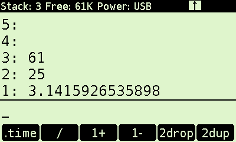
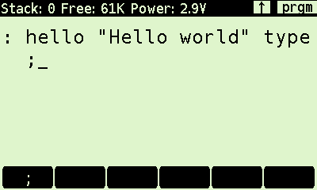
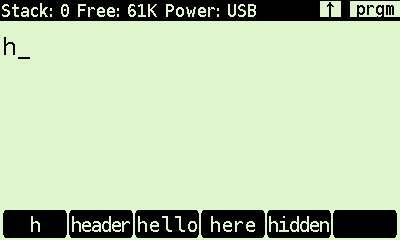
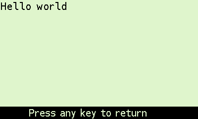

# DMFORTH
DMFORTH is a FORTH port for Swissmicros DM42 calculator (probably works on DM41X). 

This is a work in progress. Bugs could crash your calculator !

## Build
- Install GNU ARM toolchain
- `make`

## Install
- Connect USB cable from DM42 to your computer.
- Backup your data !
- Activate USB disk.
- Copy build/DMFORTH.pgm to root of calculator disk.
- Eject the calculator disk.
- In DMCP menu, load it with "Load Program" item.

## Run
### Normal mode (aka calculator mode)
In this mode, you can view 5 items of the stack and you have one line of input. Words associated with keys are executed immediately. 

For example, if you enter the number `12` and press `SIN` key, DMFORTH evaluate the line "`12 sin`", so the number `12` is pushed to the stack, and the word `sin` is executed and the result is pushed back to the stack.

You can use forth words with the functions menu (keys `F1`-`F6` and arrows keys).

### Program mode
To enter or exit: `SHIFT` `PRGM`

In this mode, the keyboard is switched to alpha mode (use `SHIFT` `ALPHA` to switch between uppercase and lowercase). To enter numbers or some operators characters (`+`,`-`, ...), use `SHIFT` and the right key. You can enter up to 6 lines of text, and `ENTER` key evaluate or compile input text.

#### Keyboard layout
Key      | Normal   | Shift
---------|----------|---------
 SIGMA   | a        | (
 INV | b | )
 SQRT | c | [
 LOG | d | ]
 LN | e | {
 XEQ | f | }
 STO | g | $
 RCL | h | %
 RDN | i | "
 SIN | j | \
 COS | k | &
 TAN | l | ,
 SWAP | m | @
 CHS | n | !
 E | o | ;
 7 | p | 7
 8 | q | 8
 9 | r | 9
 DIV | s | /
 4 | t | 4
 5 | u | 5
 6 | v | 6
 MUL | w | *
 1 | x | 1
 2 | y | 2
 3 | z | 3
 SUB | - | _
 0 | : | 
 DOT | . | 
 RUN | ?  |
 ADD | ' | +

In program mode, The functions menu works in completion mode. As words are truncated to 6 characters in this menu, a long press shows the word full name.

you can go back in the history input texts with `SHIFT` and `UP`  or `DOWN` keys. In editor mode, cursor can be moved on the line (TODO: editor mode).

### Output
When a word outputs text to LCD display, DMFORTH erase display and switch to output mode, and if rows number is greater than display lines number, DMFORTH use a basic "page mode". 

### Load FORTH programs
- Copy your FORTH program (extension: `.zf`) to calculator disk in `FORTH` folder.
- Use `SHIFT` and `0` keys to enter in the setup menu.
- Choose `Load program` item to load it.

## FORTH
- DMFORTH use a modified version of zforth (https://github.com/zevv/zForth). This is not an ANS Forth.
- DMFORTH use a heap memory block of 64 Ko to store words (32 Ko), PAD zone (16 Ko), data stack and return stack (16 Ko).
- PAD zone stores temporary strings. When this memory is full, PAD pointer is reset.
- `s" Hello"` can be written `"Hello"` .

#### Words for LCD display

Word       | Stack                 | Description
-----------|-----------------------|---------
alert      |  addr len --          | Display text in alert box
cls        |                       | Clear display
header     |  addr len --          | Display text in 1st row (reverse mode)
message    |  addr len --          | Display text in last row (reverse mode)
refresh    |                       | Refresh LCD display
setline    | lr --                 | Move to `lr` line number
setxy      | x y                   | Move to pixel at position `x` `y` 

(To complete)

